**GPG-encrypted messaging over Signal, for people who already trust GPG more than they trust any app's crypto.**

`sgpg` is a CLI and Textual chat UI that layers OpenPGP encryption on top of Signal messages. Signal is transport only. GPG is the only thing that ever touches a key or does cryptography. Nothing here reimplements, wraps, or "improves on" a cryptographic primitive — every encrypt/decrypt call shells out to the system `gpg` binary you already trust.

## Why this exists

Signal's own encryption is excellent, but it's Signal's keys, Signal's servers, Signal's trust model. If you already have a GPG identity — maybe on a YubiKey, maybe with a Web of Trust you've built for years — `sgpg` lets you keep using it, with Signal purely as the pipe the ciphertext travels through. Delete Signal tomorrow and your messages are exactly as unreadable to Signal as they always were: armored PGP blobs it's just relaying.

The wrapper never maintains its own key store. Every public key lives in your normal GnuPG keyring; `sgpg` only stores a *pointer* — a full 40-character fingerprint — mapping a Signal identity to that key.

```
Signal user/UUID/number
        │
        ▼
local contact mapping (contacts.toml)
        │
        ▼
GPG fingerprint
        │
        ▼
your normal GnuPG keyring
```

Encryption always targets two recipients — the person you're messaging, and yourself via `--encrypt-to` — so both sides can read the same ciphertext:

```bash
gpg --armor --encrypt \
    --recipient ALICE_FINGERPRINT \
    --encrypt-to YOUR_FINGERPRINT
```

## Security invariants

These are enforced, not aspirational — several have a dedicated test in `tests/test_security.py` that fails the build if violated.

| # | Invariant |
|---|---|
| 1 | No plaintext message database |
| 2 | No plaintext temporary files |
| 3 | No message body in command-line arguments |
| 4 | No private-key handling in Python |
| 5 | No custom crypto |
| 6 | All encryption/decryption goes through `gpg` |
| 7 | All GPG input/output goes through pipes |
| 8 | Ciphertext may be persisted; plaintext may not |
| 9 | Contact mappings contain fingerprints only, never copied public keys |
| 10 | Decrypted messages exist only in process/terminal memory for the duration of viewing |

Concretely, sending looks like this — plaintext only ever exists as Python bytes in transit between two pipes:

```
Python plaintext bytes         signal-cli ciphertext
      │ stdin                        │
      ▼                              ▼
     gpg                          parse envelope
      │ stdout                       │
      ▼                              ▼
armored ciphertext                 gpg --decrypt
      │                              │ stdout
      ▼                              ▼
 signal-cli                    plaintext (memory only, then wiped)
```

No `/tmp/message.txt`, ever. `crypto/gpg.py` doesn't even `import tempfile` — that's asserted in the test suite, not just promised in a docstring.

> **Threat model.** This gives you excellent protection against someone stealing an inactive computer and reading historical messages from storage. It does **not** give you protection against an attacker with root access while `sgpg` and your YubiKey are actively decrypting messages — CPython can't give hard memory-erasure guarantees, and neither can we.

## Getting started

Requires `gpg` and `signal-cli` on `PATH`, and Python 3.11+.

```bash
brew install gnupg signal-cli uv    # macOS; see signal-cli's docs for Linux
uv sync --group dev
```

**1. Link `signal-cli` to your existing Signal account.** Do this yourself, in your own terminal — it needs your phone, and the linking URI is a sensitive credential that should never leave your machine (e.g. via an online QR generator):

```bash
signal-cli link -n "sgpg" | qrencode -t ansiutf8
```

Scan the QR code from **Signal → Settings → Linked Devices → Link New Device**.

**2. Tell `sgpg` who you are** — which GPG key is yours, and your linked phone number:

```bash
sgpg identity set EBAAD74D6C1534378C0066089A1D947AAB60EEE7
sgpg identity set-account +15551234567
```

**3. Check everything's wired up:**

```bash
sgpg doctor
```

**4. Add a contact and send a message:**

```bash
sgpg contact add alice          # searches your real Signal contacts by name
echo "hey" | sgpg send alice    # reads from stdin, never argv
sgpg chat alice                 # or: open the full chat UI
```

You do **not** need to manually start `signal-cli daemon` — see [Daemon lifecycle](#daemon-lifecycle) below.

## Commands

| Command | Does |
|---|---|
| `sgpg` | Launch the Textual chat UI |
| `sgpg chat NAME` | Open the chat UI directly on one contact |
| `sgpg send NAME [--sign]` | Encrypt a message (read from stdin) and send it |
| `sgpg read NAME [-n 20]` | Decrypt and print the last N messages |
| `sgpg inbox` | List contacts with recent activity |
| `sgpg doctor` | Report whether your security configuration is actually working |
| `sgpg contact add NAME [--signal-number/-uuid] [--query]` | Add a contact: search Signal + your GPG keyring |
| `sgpg contact list` / `show NAME` / `verify NAME` | Inspect a contact's mapping and key validity |
| `sgpg contact set-key NAME FPR` | Point a contact at a different fingerprint |
| `sgpg key show NAME` / `sgpg key import FILE` | Inspect a contact's key / import a public key |
| `sgpg identity set FPR` / `set-account NUMBER` / `show` | Configure your own GPG key and Signal number |
| `sgpg card learn` | Re-run GnuPG's card-relearn sequence after a YubiKey swap |

Global options (`--gnupghome`, `--contacts-path`, `--socket-path`, `--account`, `--auto-daemon/--no-auto-daemon`) work on every command — `sgpg --help` for the full list.

## How sending and receiving work

**Sending** (`sgpg send alice`):

```
1. Resolve alice → Signal identity           (contacts.toml)
2. Resolve alice → GPG fingerprint            (contacts.toml)
3. Ask GPG whether the key is usable          (not expired/revoked, has an encryption subkey)
4. Read plaintext from stdin
5. Pipe it into gpg --encrypt --recipient alice --encrypt-to you
6. Wrap the armored ciphertext in an SGPG/1 envelope
7. Hand the envelope to signal-cli
8. Zero the plaintext buffer
```

GnuPG's own trust machinery (Web of Trust / TOFU) stays in control throughout — `sgpg` never passes `--trust-model always`. If a key isn't sufficiently trusted, GnuPG refuses and that refusal is surfaced to you, not silently bypassed. ([GnuPG configuration reference][1])

**The envelope** is deliberately almost nothing:

```
SGPG/1
-----BEGIN PGP MESSAGE-----
...
-----END PGP MESSAGE-----
```

Incoming Signal messages are classified strictly by that first line — `ordinary`, `SGPG`, `unsupported version`, or `malformed` — so a normal Signal message can never accidentally be piped into `gpg --decrypt`. Only version 1 exists today; a future `SGPG/2` could add headers without inventing any crypto of its own.

**Receiving** uses `signal-cli`'s JSON-RPC daemon interface rather than polling `signal-cli receive` and scraping text output, so incoming messages arrive as structured notifications. ([signal-cli JSON-RPC reference][2])

```
signal-cli daemon (socket) → JSON-RPC notification → parse envelope
                                                            │
                                          SGPG?  ───────────┤
                                           │no              │yes
                                           ▼                ▼
                                    render as-is      gpg --decrypt
                                                            │
                                                     plaintext in memory
                                                            │
                                                       render, then wipe
```

GPG's `--status-fd` machine-readable status protocol (never stderr text, never exit codes alone) drives what the UI shows: `🔐 Decrypted using YubiKey`, `✓ Encrypted to your key`, `✓ Signature: alice (verified fingerprint)`.

## Trust: how `sgpg` decides a key belongs to a contact

**It doesn't — you do.** `sgpg contact add` runs two independent, unverified searches: your real Signal contacts (via `listContacts`) and your local GPG keyring (a plain substring match on the key's self-asserted User ID — anyone can put anyone's name on a key). The only real security boundary is the confirmation step:

```
$ sgpg contact add alice

Signal contacts matching "alice":
1. Alice Example  +15551234567

GPG keys matching "alice":
1. Alice Example <alice@example.com>
   0123 4567 89AB CDEF ...
   Encryption: valid
   Expires: 2029-04-18

Verify this fingerprint with Alice out-of-band:
0123 4567 89AB CDEF ...

Associate this key with Alice? [y/N]
```

That confirmation is *you* asserting you checked the fingerprint through a channel you trust separately from Signal and separately from wherever the key came from — the same model as Signal's own safety-number verification, one layer up. Importing a key (`sgpg key import`) never implies trust by itself.

## Daemon lifecycle

`signal-cli daemon` takes about half a second to start (measured, not assumed), so its lifetime just mirrors `sgpg`'s own rather than running forever in the background:

- If a daemon is already listening on the configured socket, `sgpg` uses it and leaves it completely alone — it might be yours, running manually, or serving something else.
- If not, `sgpg` spawns one for the duration of the command (or the chat session, for `sgpg chat`/bare `sgpg`) and terminates it again on the way out.
- `sgpg doctor` never auto-spawns — it's diagnostic-only, zero side effects.

Disable this with `--no-auto-daemon` if you'd rather manage `signal-cli daemon` yourself.

## Chat UI

Built with [Textual][4], an async Python TUI framework — a natural fit for a Signal RPC/event-loop-driven interface:

```
┌ sgpg ─ alice ──────────────────────────────────────────┐
│                                                          │
│  alice                                   08:14          │
│  Did the deploy finish?                                 │
│                                                          │
│                                You        08:16          │
│                       Yep, everything looks good.        │
│                                                          │
│  alice                                   08:18          │
│  Great. Let's ship it.                                   │
│                                                          │
├──────────────────────────────────────────────────────────┤
│ Write a message…                                         │
├──────────────────────────────────────────────────────────┤
│ 🔐 connected to Signal daemon                             │
└──────────────────────────────────────────────────────────┘
```

Message bubbles are **rendered from ciphertext on demand**: opening a contact decrypts their last 20 messages into memory and builds the widgets; switching away clears the widget tree and wipes the decrypted buffers. There is no local plaintext chat database — only the metadata/ciphertext store below, decrypted fresh every time.

Your OpenPGP card's PIN caching through `gpg-agent` means opening a conversation doesn't mean twenty separate PIN prompts — GPG handles that itself while the card session is active.

## Disk storage

|  | Persisted where | Encrypted? |
|---|---|---|
| Signal UUID/number, nickname, GPG fingerprint | `~/.config/sgpg/contacts.toml` (`0600`) | No — protected by file permissions only |
| Message metadata (direction, timestamp, was-it-SGPG) | `~/.local/share/sgpg/metadata.db` (SQLite, `0600`) | No — metadata only |
| Message **content** | same SQLite DB, `ciphertext_armored` column | **Yes** — literal PGP ciphertext, unreadable without your private key |

There is no `messages.plaintext` column anywhere in the schema — not "encrypted at the app layer," not present at all.

One deviation from the obvious design: `signal-cli`'s JSON-RPC surface has no history-replay method, only a live `receive` stream — so "decrypt the last N messages" only works if `sgpg` keeps its own local copy of the SGPG ciphertext as messages arrive, rather than re-querying Signal's own storage. Invariant #8 (ciphertext may be persisted) is exactly what makes that a legitimate design, not a compromise.

## Known gaps

Being upfront about what isn't here yet:

- **Attachments.** Text only, for now — a smaller threat model is easier to reason about correctly than a bigger one shipped fast.
- **Group conversations.** Contact resolution is 1:1 (Signal UUID/number ↔ GPG fingerprint); group messages aren't a first-class concept yet.
- **Full memory-erasure guarantees.** `bytearray` buffers are explicitly zeroed after use and core dumps are disabled, but CPython can still make copies of some values internally, and the OS can swap memory to disk. See the threat model note above.

## Project layout

```
src/sgpg/
├── cli.py              Typer CLI: every operation is a plain command
├── app.py               Composition root — CLI and TUI are thin layers over this
├── security.py           Process hardening: core dumps, log level
├── paths.py              XDG config/data locations
├── history.py             SQLite metadata + local ciphertext store
├── crypto/
│   ├── gpg.py              Disciplined subprocess adapter around `gpg` — not a crypto impl
│   ├── status.py            Parses gpg's --status-fd protocol
│   └── card.py               OpenPGP smartcard (YubiKey) status + relearn
├── signal/
│   ├── client.py            High-level Signal client + daemon lifecycle
│   ├── rpc.py                 Generic JSON-RPC 2.0 client (newline-delimited)
│   └── messages.py             Parses receive/contact notifications
├── contacts/
│   ├── store.py               TOML contact store (fingerprints, never keys)
│   └── resolver.py             Turns a stored fingerprint into a validated, usable key
├── protocol/envelope.py    The SGPG/1 envelope
└── tui/                    Textual chat UI (app, conversation, composer, contacts)
```

## Development

```bash
uv sync --group dev
uv run pytest                # 117 tests, against an isolated disposable GnuPG keyring
uv run ruff check .          # lint, incl. flake8-bandit security rules
uv run ruff format --check .
uv run mypy                  # strict
```

Tests never touch your real GnuPG keyring or spawn a real `signal-cli daemon` — everything is generated fresh in a scratch keyring or mocked at the subprocess boundary, specifically so a bug in a test can't leak a background process or read your real keys.

`sgpg doctor` example output:

```
✓ gpg found: gpg (GnuPG) 2.5.21
✓ signal-cli found
✓ Signal daemon reachable

Identity:
✓ EBAAD74D6C1534378C0066089A1D947AAB60EEE7
✓ Signal account: +15551234567

YubiKey:
✓ OpenPGP card detected (serial 19324655)
✓ signing subkey available
✓ encryption subkey available

Contacts:
✓ 4 contacts
! 1 contact has expired/revoked keys

Plaintext persistence:
✓ debug logging disabled
✓ core dumps disabled
```

For something whose entire purpose is protecting message history, being able to see **"is my security configuration actually working?"** is unusually valuable.

---

Architecture, in one line: **Signal owns transport, GPG owns identity/keys/crypto, YubiKey owns private operations, `sgpg` owns orchestration and UI only.**

[1]: https://gnupg.org/documentation/manuals/gnupg/GPG-Configuration-Options.html "GPG Configuration Options (Using the GNU Privacy Guard)"
[2]: https://github.com/AsamK/signal-cli/blob/master/man/signal-cli-jsonrpc.5.adoc "signal-cli JSON-RPC reference"
[3]: https://gnupg.org/documentation/manuals/gnupg26/gpg.1.html "GPG(1)"
[4]: https://github.com/Textualize/textual "Textual"
